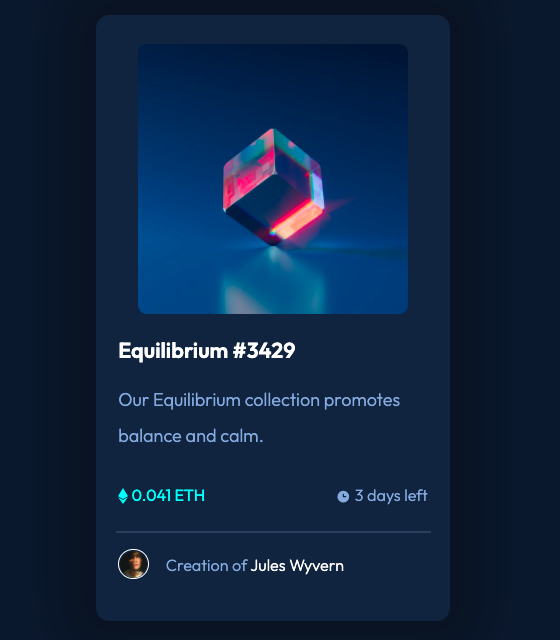
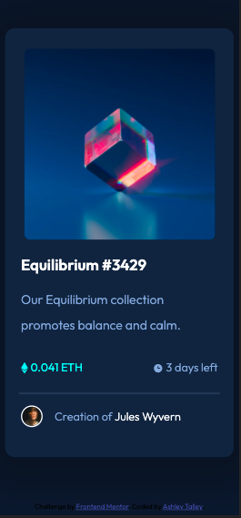

# Frontend Mentor - NFT preview card component solution

This is a solution to the [NFT preview card component challenge on Frontend Mentor](https://www.frontendmentor.io/challenges/nft-preview-card-component-SbdUL_w0U). Frontend Mentor challenges help you improve your coding skills by building realistic projects.

## Table of contents

- [Overview](#overview)
  - [The challenge](#the-challenge)
  - [Screenshot](#screenshot)
  - [Links](#links)
- [My process](#my-process)
  - [Built with](#built-with)
  - [What I learned](#what-i-learned)
  - [Continued development](#continued-development)
  - [Useful resources](#useful-resources)
- [Author](#author)

## Overview

### The challenge

Users should be able to:

- View the optimal layout depending on their device's screen size
- See hover states for interactive elements

### Screenshot

- Screenshot from desktop: 
- Screenshot from responsive view at 375px wide: 

### Links

- Solution URL: [Add solution URL here](https://https://github.com/atalley3/Frontendmentor-NFT-card)
- Live Site URL: [Add live site URL here](https://https://elegant-cori-fcdd4d.netlify.app/)

## My process

### Built with

- Semantic HTML5 markup
- CSS custom properties
- Flexbox
- Active state with image roll over
- Media queries for responsive design

### What I learned

This is my first Frontend Mentor Challenge and I will be persuing more challenges. Prior to this challenge, I had not produced any responsive designs nor image overlys. Research was required to make this elements work.

For the responsive features, I worked desktop first and used media queries to transition to a smaller screen

Here is a sample of that code:

```css media query
@media (max-width: 375px) {
  main {
    max-width: 275px;
    margin-top: 60px;
    margin-bottom: 60px;
  }
  .img-container {
    max-width: 275px;
  }

  .box {
    padding: 15px 3px 10px 3px;
    font-size: 16px;
  }
}
```

```css image overlay snippet
.overlay {
  position: absolute;
  top: 0;
  bottom: 0;
  left: 0;
  right: 0;
  opacity: 0;
  transition: all 0.3s ease;
  background: hsla(178, 100%, 50%, 50%);
}
.img-container:hover .overlay {
  opacity: 1;
}
.icon {
  color: white;
  font-size: 100px;
  position: absolute;
  top: 50%;
  left: 50%;
  transform: translate(-50%, -50%);
  -ms-transform: translate(-50%, -50%);
  text-align: center;
}
.hover-icon:hover {
  color: #eee;
```

### Continued development

Areas of opportunity include more responsive designs, larger scale Flexbox, and css positioning.

### Useful resources

- [CSS Tricks Blog](https://https://css-tricks.com/a-complete-guide-to-css-media-queries/) - This blog entry introduced me to media query syntax. It is an depth article that covers responsive design and accessibility.

## Author

- LinkedIn - [Ashley Talley](https://https://www.linkedin.com/in/ashley-talley-41271950/)
- Frontend Mentor - [@atalley3](https://www.frontendmentor.io/profile/atalley3)
- GitHub - [@atalley3](https://www.github.com/atalley3)
